# DALAI

This is a pioneering method for ab initio model analysis of X-ray solution scattering. The method consists of fitting the scattering profile computed from sphere packet models of the molecule, using the Debye formula. The bead models are optimized using a genetic algorithm that searches the huge space of possible mass distributions and evolves convergent models. The current DALAI_GA version 3 (2006) is a slightly improved genetic algorithm from the original implementation (1998...last century!). We still encourage further applications of this vintage method because it works!

References

- P. Chacón, J. F. Díaz, F. Morán and J.M. Andreu (2000) Reconstruction of Protein Form with X-ray Solution Scattering and a Genetic Algorithm, J.Mol.Biol. 299: 1289-1302. <a href="http://www.ncbi.nlm.nih.gov/entrez/query.fcgi?cmd=Retrieve&amp;db=PubMed&amp;list_uids=10873453&amp;dopt=Abstract"></a> <a href="https://chaconlab.org/PDF/jmb2000.pdf"></a>

- P. Chacón, F. Morán, J.F. Díaz, E. Pantos, and J.M. Andreu (1998) Low-Resolution Structures of Proteins in Solution Retrieved from X-Ray Scattering with a Genetic Algorithm, Biophys. J. 74: 2760-2775. <a href="http://www.ncbi.nlm.nih.gov/entrez/query.fcgi?cmd=Retrieve&amp;db=PubMed&amp;list_uids=9635731&amp;dopt=Abstract"> </a><a href="PDF/bj98.pdf"></a>

To illustrate the basic procedure to run the program her you can find several examples. In this first example the protein Beta b2-crystallin (2bb2 pdb entry) is modelled from SAXS.  The data to be downloaded is calculated from 2bb2.pdb using the Debye formula, and from this theoretical SAXS profile the size &amp; shape of this protein will be reconstructed.
Please, download now the following files: 
<ul style="list-style-type: circle;">
<li>The parameter file: <a href="assets/dalai_ga.ini">dalai_ga.ini</a></li>
<li>The data file: <a href="assets/2bb2.int">2bb2.int</a></li>
<li>The initial search space (optional). There are two options  1) Direct generation of an ellipsoids from parameter file 2) Introduce your own conformational search space (e.g. <a href="assets/L162.pdb">L102.pdb)</a>. For simplicity, in this example, DALAI-GA will generate a hexagonal packet of beads.</li>
</ul>
That's all that is needed to start. First of all, have a look at the parameter file, it looks like that:

```
FILEINPUT 2bb2.int  (SAXS data generated from the 2bb2 pdb entry) 
FILEMODEL none      (No input initial search space) 
ELLSIZE 150 100 100    (Dimensions of the initial ellipsoid search space) 
RADIUS 7.0          (The beads will be of 6 A radius) 
DELTA_R 1.0         (Reduction of R when new search space will be generated) 
END_R  3.0          (maximal resolution R allowed) 
MASS+/- 40 10       (Rejection size range in the initial population of the models) 
RG+/- 30 5   	    (Allowed Rg range  in the initial population ) 
NL/NC 10 100 200 500 (The program will wait 10 generations until starts waiting for convergece for all steps except the last one, then if after 100 generations without change of the best solution will consider convergence reached and will proceed to the next resolution step, for the last resolution step them the wait will be 200 generations and the convergence considered to be reached after 500 generations without change) 
DISPLAY 1    (Some info will show up on your screen while the soft is running)
´´´

´´´
 ========================================================
  ==                                                    ==
  ==            DALAI_GA2 v3   Update 5/5/06            ==
  ==                                                    ==
  ==             --------------------------             ==
  ==                                                    ==
  ==       http:\\sbg.cib.csic.es\Software\Dalai_GA     ==
  ==                                                    ==
  ========================================================

  ==  INITIAL CONFIGURATIONAL SPACE:

    409 spheres (ELLIPSOID 10x8x8)  of radius 7.000000 

    Box 140.000000 X 96.994845 X 91.447617 

    volumen 587632.811459 
 -------------------------------------
    Saved PDB init_confR7.0.pdb
    PAIR-PAIR TYPES 88
    RG 46.10 MassNorm 2064265 
    
 == SAXS DATA

    Opened 2bb2.int ......  64 point read 
    Srange 0.000000 - 0.060001 inter 0.000938 
    Internal particle constant 0.000000  

    WARNING!!!
    Nominal SAXS resolution limit at R=4.166568
    For radius 7.000000 Smax=0.035714
    New Srange with 38 points 
    Smin-Smax 0.000000 - 0.035239 inter 0.000927 

 == Generating initial random generation
     DISCART RG  802  FIT 0
     AVE RG  27.75  FIT 1.64
     DISCART RG  7209  FIT 0
     AVE RG  24.32  FIT 3.38

-------------------------------------------------------------
-------------------------------------------------------------

 Overall time... 0 | Time R=7.0 0 | Converge time 100 
 
  Pos    Fv       N    Rg    OGA     Rf          RMS
   1   13.9963   11  24.0811  0   7.6317e-02  1.8007e-02
   2    9.6080   12  21.2897  0   1.5829e-01  3.8345e-02
   3    9.3178   11  22.6603  0   1.5382e-01  3.6936e-02
   4    8.8105   11  23.2251  0   1.3734e-01  3.2713e-02
   5    8.2619   11  23.9800  0   1.5966e-01  3.8039e-02
   6    8.1279   11  21.7111  0   1.7792e-01  4.2710e-02
   7    7.4909   12  24.0514  0   1.3590e-01  3.2245e-02
   8    7.3235   12  22.7126  0   1.6541e-01  3.9684e-02
   9    7.2746   12  21.9817  0   1.8130e-01  4.3646e-02
  10    7.2634   11  23.3642  0   1.7253e-01  4.0984e-02

 Best configuration:

000000000000000000000000000000000000000000000000000
000000000000000000000000000000000000000000000000000
000000000000000000000000000000000000000000000000000
000000000000000000000000000000010000000001000000000
100000000010000000110000000000000000000000000000000
110000000000100000000000000001000000001000000000000
000000000000000000000000000000000000000000000000000
000000000000000000000000000000000000000000000000000
0
    Saved PDB best_0.pdb
 === New Max FIT 15.6414 N 10 ===
     Saved PDB best.pdb
     Saved SAXS best.dat
 === New Max FIT 19.5908 N 11 ===
    Saved PDB best.pdb
    Saved SAXS best.dat 
```
<p>Each 10 generations the results are printed. The program will finish modelling at a given resolution when it has reached convergence. The fitting results are(best****.dat files) and the structures ofthe best models (best****.pdb files). The best configurations resulting can be displayed using rasmol (rasmol best.pdb; spacefill 160)

<p>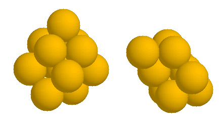</p>
<p>and you can see the corresponding fits using your favorite plotting program, for example using gnuplot:</p>
<p><a href="images/plot_big.gif">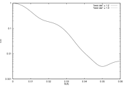</a>&gt;gnuplot <br />gnuplot&gt;  set logscale y <br />gnuplot&gt;  set xlabel "S(A)" <br />gnuplot&gt;  set ylabel "I(S)" <br />gnuplot&gt; plot "best.dat" u 1:2 w l, "best.dat" u 1:3 w l</p>

Once the converges, the program automatically generates a new configurational space with a smaller bead radius from the best previous results.</p>
<pre>==  MASK PROCEDURE 
    146 hexagonal beads from box 479 of best config with 23 
    PAIR-PAIR TYPES 69 
    RG 28.08 MassNorm 274156
    --&gt;Saved PDB init_confR5.0.pdb
</pre>
<p>the configurational space is saved</p>
<p>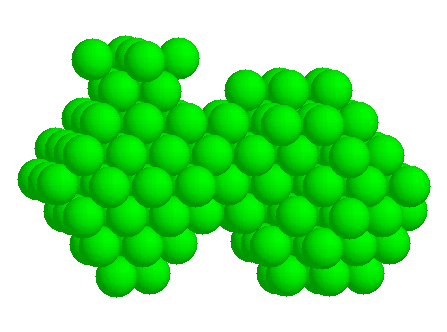</p>
<p> The SAXS range take is modified according to the bead size used and a new initial population is generated</p>
<pre>    WARNING!!! 
    Nominal SAXS resolution limit at R=4.199422 
    For radius 5.000000 Smax=0.050000 
    New Srange with 214 points 
    -&gt;Smin-Smax 0.000100 - 0.049939 inter 0.000233
      init max/min 62/17  target natom 0.0 
      init RG/RG_DELTA 24.70/4.94 
      mask conf Natom   40 RG 25.50 FIT 6.634239 
     DISCART RG  4980  FIT 2001 
     AVE RG  21.19  FIT 4.31
</pre>
<p>This refinement is repeated until the desired resolution (parameter END_R in dalai_ga.ini), or automatically when the search space gets larger than 2,000 beads. At the end, one should have a complete set of models/fits (files *.pdb/*.dat), including the final results best.pdb and the corresponding fits best.pdb. The model with 3A radius beads looks like this:</p>
<p>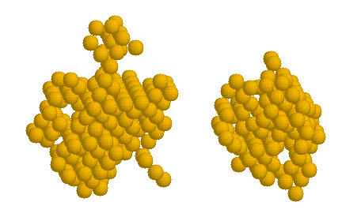</p>
<p>That is, the structure obtained is convergent with the original crystallographic structure(2bb2 pdb entry), at a lower resolution</p>
<p>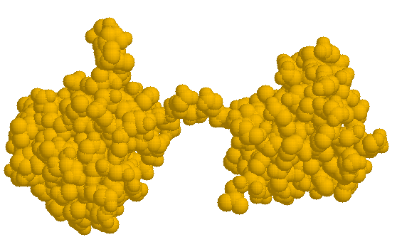</p>
<p>As a second example,  we use the simulated SAXS profile produced by program DALAI using all 1914 atoms in the 1cfb.pdb file. We limit the range to be fitted to S=0.06A <sup>-1</sup> , corresponding to real space resolution of 1/2S= 8.3A . Figure 7 shows a configurational space of 254 spheres of radius 6A .The spheres are hexagonally packed to provide the best mass sampling and are all within an ellipsoid of revolution of major/minor axes of 100/70A . This space is large enough to contain the crystal structure of two adjacent fibronectin type III repeats from the Drosophila neural cell adhesion molecule neuroglian (Huber et al. 1994, 1cfb entry in Brookhaven database). </p>
<table cellspacing="0" cellpadding="0">
<tbody>
<tr>
<td><center>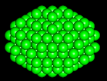</center></td>
<td><center>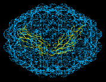</center></td>
<td><center>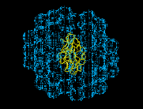</center></td>
</tr>
<tr>
<td><center>a</center></td>
<td><center>b</center></td>
<td><center>c</center></td>
</tr>
</tbody>
</table>
Figure 7. a) The configurational space of 254 spheres of radius 6A . b) and c) Connoly surface representation of the configuration space with ribbon representation of the target structure embedded in it at two orthogonal projections.
Figure 8 shows the SAXS fit (fit and target profile can hardly be distinguished) and the average fitness of the parent population with the values for the best fits at a given iteration superimposed as spikes. Successively better fits improve the "genetic stock" until little further improvement can be achieved. Despite the enormous size of the configuration space (2<sup>254-1</sup>) the pertinent shape features of the structure at that resolution have been quickly identified. Only 29 spheres out of the 254 are retained. It is also clear that the size of the spheres is too large to accommodate fine details in the periphery of the molecule. This is reflected in ripples in the residual curve in Figure 8.
<table cellspacing="0" cellpadding="0">
<tbody>
<tr>
<td><center>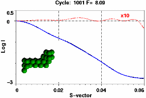</center></td>
<td><center></center></td>
</tr>
</tbody>
</table>
<p> Figure 8. Top: Best fitted profile and residual (dashed line x10) after 330 iterations. The residual (dotted line) is scaled x10. Bottom: Average population fitness as a function of iteration number. The spikes superimposed on the smooth graph give the fit value of the best fit attained at a given iteration number.</p>
<center>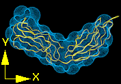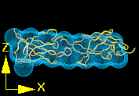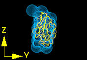</center>
<p>Figure 9.Three projections of the fitted structure with the crystal structure shown in ribbon representation and the best fit of 6A spheres as a Conolly surface produced by program Insight II.</p>
<p>Increase in the quality of fit can now only be achieved by increasing the resolution of the configuration space (smaller spheres in a finer grid). Alternatively, as the low resolution shape of the structure is now known, the best fitted structure can now be used as a "mask", augmented by a margin around it and imposed on a finer resolution configuration space to define a subset of the spheres that would be contained in the original ellipsoid. This reduces the memory and processing time requirements significantly without loss in information to be extracted (Figure 10).</p>
<center>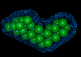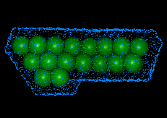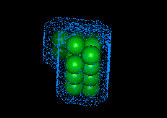</center><center>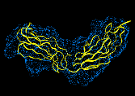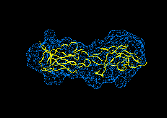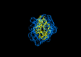</center>
<p>Figure 10 Top: Three orthogonal projections of finer resolution configuration space of 536 spheres of radius R=3A produced by adding a surface layer of 12A on the best fit from the previous run. Bottom: The best fitted structure (F=143) obtained by rerunning the algorithm.</p>
<p>If you feel already comfortable , it is time  to try to model real datasets. Two test examples are: </p>
<ul>
<ul>A) Troponin with 2 high affinity sites Calcium sites liganded:</ul>
</ul>
<p><a href="assets/ca2mg0.zip">ca2mg0.zip</a></p>
<ul>Data cortesy of Prof. T. Fujisawa (Fujisawa et al., J. Biochem Tokio 105:377-383, 1989. Fujisawa et al., J. Biochem. Tokio 107:343-351. 1990).</ul>
<ul>
<ul>B) The Beta4 fragment of alfa-beta 4 Integrin:</ul>
</ul>
<p><a href="assets/DALAI_GA/integrin.zip">integrin.zip</a></p>
<ul>Protein kindly provided by Dr. J.M. De Pereda (de Pereda et al., EMBO J. 18:4087-4095, 1999): Now you may try with your own data and search spaces, best luck and let us know your results!. </ul>
